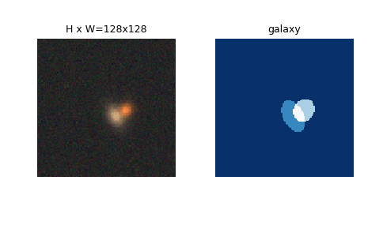
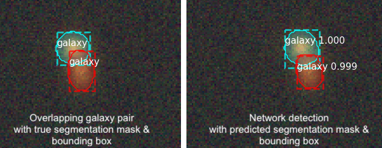

# Separating overlapping galaxies with Mask R-CNN

Most observed astronomical objects have some overlap with neighboring objects. However, scientific measurements require isolated galaxy images. We explore the application Mask Region-based CNN ([Mask R-CNN](https://arxiv.org/abs/1703.06870)) to separate images of overlapping astronomical bodies ("deblending").

*This repository is a part of a research project in progress.*
This code uses the Python 3, Keras, and TensorFlow [implementation](https://github.com/matterport/Mask_RCNN) of Mask R-CNN to perform instance segmentation on images of overlapping galaxy pairs. The out-of-the-box implementation of MRCNN is optimized for performing images on the [MS COCO Dataset](http://cocodataset.org/#home). 

* ([model.py](mrcnn/model.py), [utils.py](mrcnn/utils.py), [config.py](mrcnn/config.py)): These files contain the main Mask RCNN implementation. 

* [train.py](scripts/train.py) trains the network.

* [evaluate.py](scripts/evaluate.py) runs the network on validation set to test performance.

Our dataset image size is 120x120 , much smaller than the 800x800 for training the MS COCO dataset. Thus the RPN anchor sizes were reduced in proportion in order to be able to detect features with scales desired here.  

# Training Data

The network was trained on simulated overlapping galaxy images with varying degrees of overlap. The galaxies were simulated using WeakLensingDeblending Package as sersic bulge + disk profiles. Segmentation maps are regions with pixel values above a threshold value for each galaxy.

The trained network is able to detect individual galaxies in the overlapping pair images along with producing a segmentation mask and bounding box.

